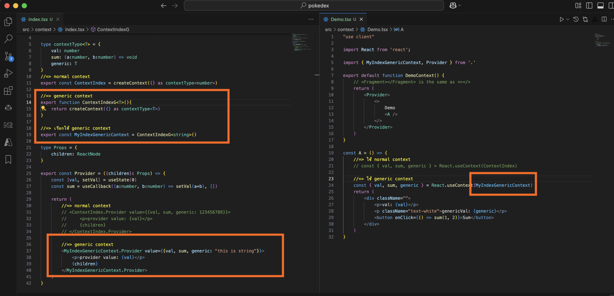
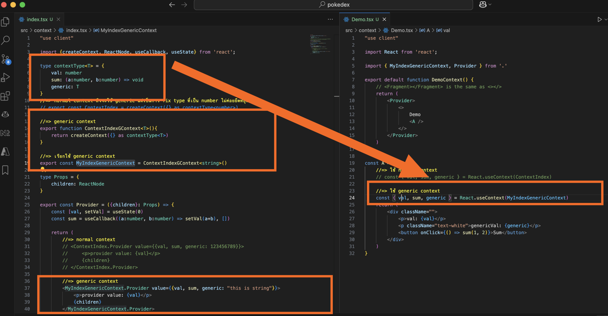

# Context
เป็นตัวจัดการ state ต้องเอา provider ของ context ไปครอบ state ที่มันจะใช้่

จริงๆแล้ว มันคือกลุ่มก้อนของอะไรบางอย่าง อาจจะเป็น function หรือ state มันสามารถส่งต่อไปให้ลูกๆมันได้
เป็นการ provide state หรือ function ที่อยู่ใต้มันให้เรียกใช้ได้

ครอบที่ page หรือ root component

state management
- redux
- recoil
- context

ปัจจุบันใช้ context

## React18 Context
</img>

# React 18 Generic Context
</img>
</img>